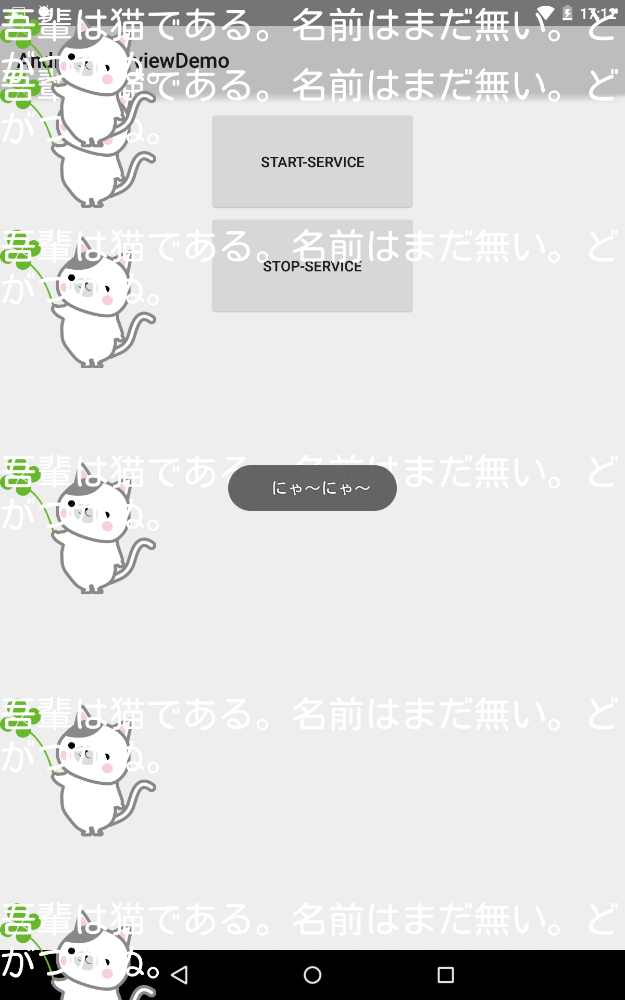

# AndroidOverviewDemo

This is an Android WindowManager.LayoutParams.Class Sample Project.
You can flow comments over the home screen like Niconicovideo.

## Usage

git clone git@github.com:oggata/AndroidOverviewDemo.git

## ToDo's
- Enable to get comments from twitter API etc...

## Document
Qiita
http://qiita.com/oggata/items/a579ac36ddb35d176004

## Images
cat free images
http://shigenori-terazawa.seesaa.net/article/407247100.html

## Contact

Fumitoshi Ogata
- [twitter.com/oggata](http://twitter.com/oggata)
- oggata@gmail.com

## License
FacialRecognition is available under the MIT license. 
See the LICENSE file for more info.
